# ⚙️ GymRats - Aplicación Android

Este repositorio contiene la aplicación móvil nativa de **GymRats**, desarrollada con Kotlin y Jetpack Compose para ofrecer una experiencia de usuario fluida y moderna en la gestión de centros deportivos desde dispositivos Android.

## 🛠️ Stack tecnológico

| Tecnología | Versión | Propósito |
|------------|---------|-----------|
| Kotlin | 1.9+ | Lenguaje principal de desarrollo |
| Jetpack Compose | 1.6+ | Interfaz de usuario declarativa |
| Android SDK | API 24-36 | Compatibilidad con dispositivos Android |
| Retrofit | 2.9.0 | Cliente HTTP para comunicación con la API REST |
| Gson Converter | 2.9.0 | Serialización/deserialización JSON |
| Coil | 3.3.0 | Carga asíncrona de imágenes |
| CameraX | 1.4.0 | Gestión de cámara para escaneo QR |
| ML Kit Barcode | 17.3.0 | Detección y lectura de códigos QR |
| ZXing Core | 3.5.3 | Generación de códigos QR |
| DataStore | 1.1.1 | Persistencia de preferencias y sesión |
| Accompanist Permissions | 0.34.0 | Gestión simplificada de permisos |
| Compressor | 3.0.1 | Optimización de imágenes antes de subir |

## 📱 Requisitos del sistema

- **Android mínimo:** API 24 (Android 7.0 Nougat)
- **Android objetivo:** API 36
- **Permisos requeridos:**
    - `INTERNET`: Comunicación con la API backend
    - `CAMERA`: Escaneo de códigos QR para acceso a gimnasios
- **Hardware recomendado:** Cámara trasera funcional para escaneo QR

## 📂 Estructura del proyecto

```
Android-APP/
├── app/
│   ├── src/main/
│   │   ├── java/com/gymrats/gymratsapp/
│   │   │   ├── components/          # Componentes UI reutilizables
│   │   │   ├── data/                # Modelos de datos y gestión de sesión
│   │   │   ├── navigation/          # Navegación entre pantallas
│   │   │   ├── remote/              # Configuración de Retrofit y API
│   │   │   ├── screens/             # Pantallas principales de la app
│   │   │   ├── ui/theme/            # Tema, colores y tipografías
│   │   │   └── viewModels/          # ViewModels con lógica de negocio
│   │   ├── res/
│   │   │   ├── drawable/            # Recursos gráficos vectoriales
│   │   │   ├── font/                # Fuentes personalizadas (Poppins)
│   │   │   ├── mipmap-*/            # Iconos de la aplicación
│   │   │   ├── values/              # Strings, colores y temas
│   │   │   └── xml/                 # Reglas de backup y extracción
│   │   └── AndroidManifest.xml      # Configuración global de la app
│   └── build.gradle.kts             # Dependencias y configuración de compilación
├── gradle/                          # Configuración de Gradle Wrapper
├── build.gradle.kts                 # Configuración del proyecto raíz
└── settings.gradle.kts              # Módulos del proyecto
```

## 🖼️ Pantallas de la aplicación

### 👤 Usuario estándar

| Pantalla | Descripción                                                | Ruta de imagen sugerida                                                                     |
|----------|------------------------------------------------------------|---------------------------------------------------------------------------------------------|
| **Inicio de sesión** | Autenticación con email y contraseña                       | 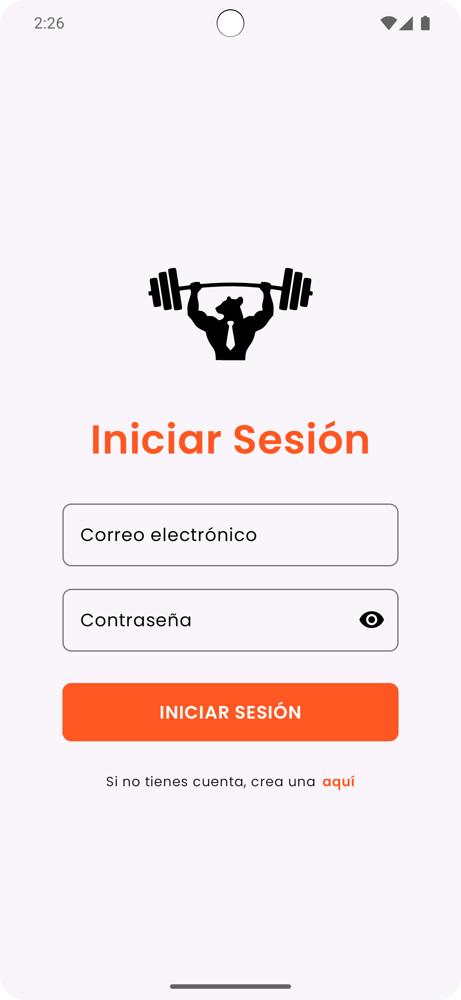                                                           |
| **Registro** | Creación de nueva cuenta con validación de contraseña      | 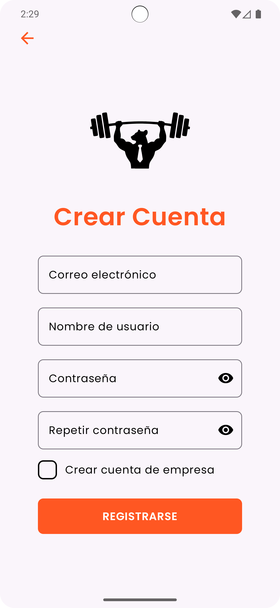                                                         |
| **Inicio (Home)** | Vista de suscripciones activas y gimnasios descubiertos    | 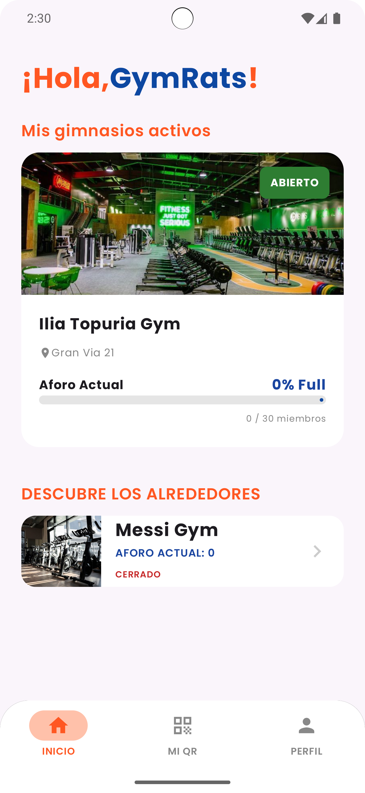                                                        |
| **Detalle de gimnasio** | Información completa, estado de apertura y aforo actual    | 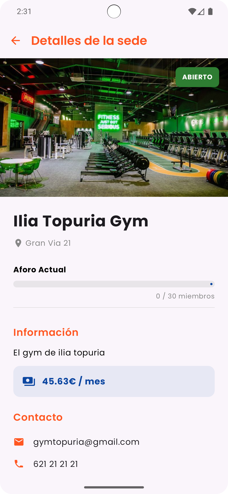                                            |
| **Mi código QR** | Código personal para escaneo en acceso a gimnasios         | 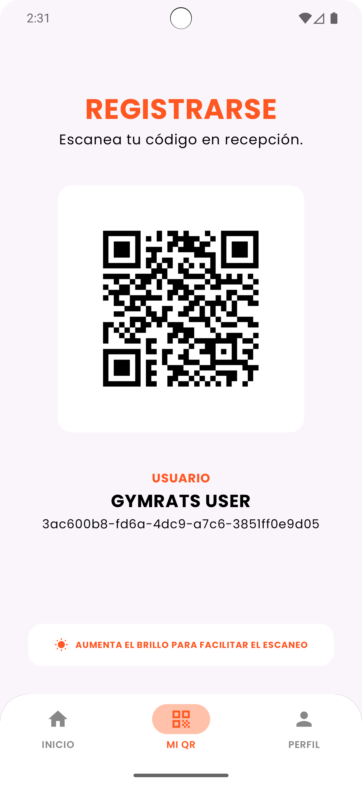                                                       |
| **Perfil de usuario** | Datos personales, foto de perfil y estado de suscripciones | 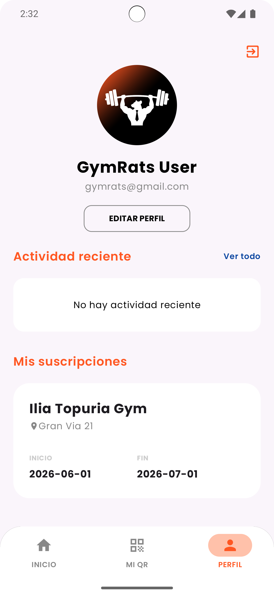                                                  |
| **Editar perfil** | Actualización de nombre, username y avatar                 | 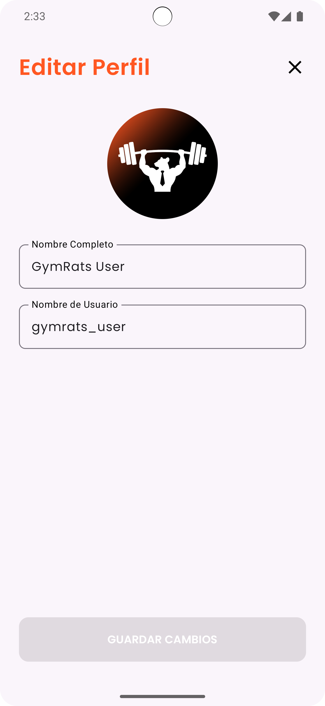                                             |
| **Historial de actividad** | Registro cronológico de accesos a gimnasios                | 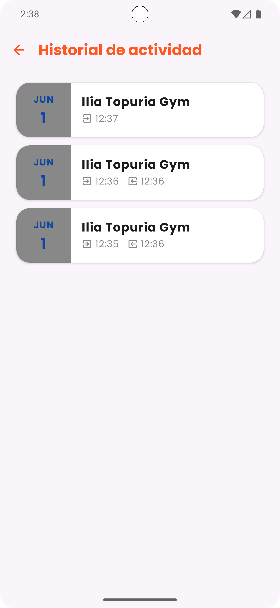 |

### 🏢 Usuario enterprise (propietario de gimnasio)

| Pantalla | Descripción                                                       | Ruta de imagen sugerida                                   |
|----------|-------------------------------------------------------------------|-----------------------------------------------------------|
| **Inicio enterprise** | Panel con el listado de sedes gestionadas                         | 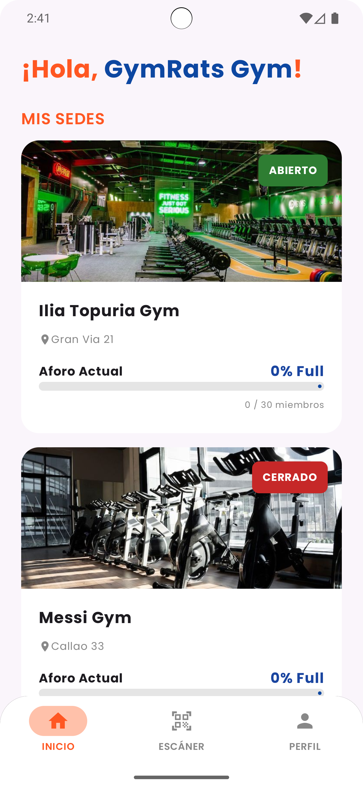          |
| **Crear nueva sede** | Formulario para registrar un nuevo gimnasio con imagen y datos    | 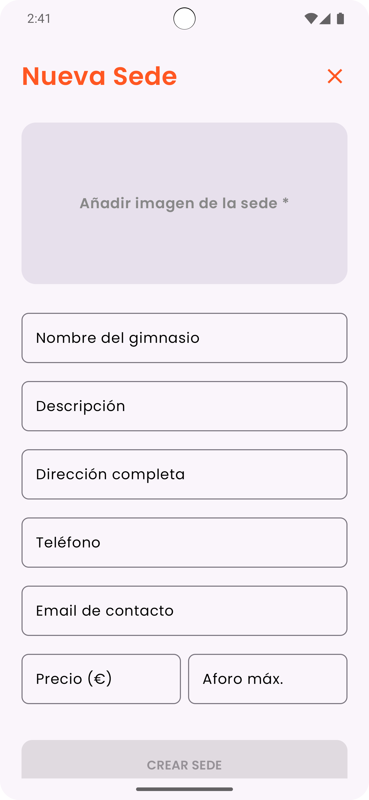         |
| **Editar sede** | Modificación de datos, capacidad y estado de una sede existente   | 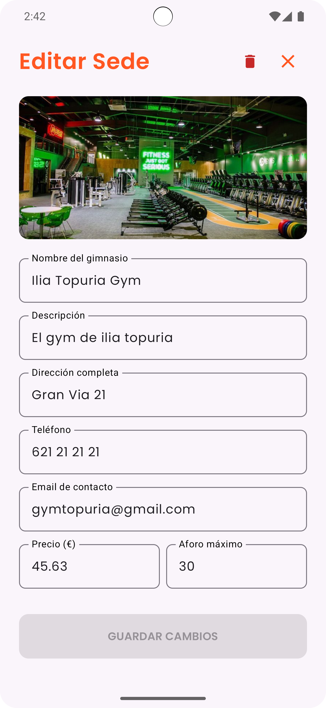             |
| **Gestionar socios** | Listado de miembros vinculados y opción para añadir nuevos        | 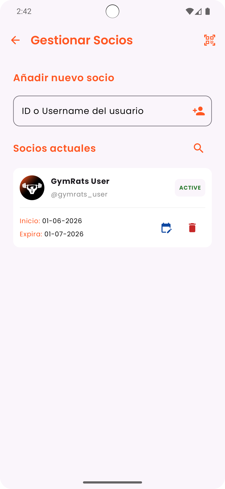 |
| **Escáner QR** | Vista de cámara para validar accesos de socios en tiempo real     | 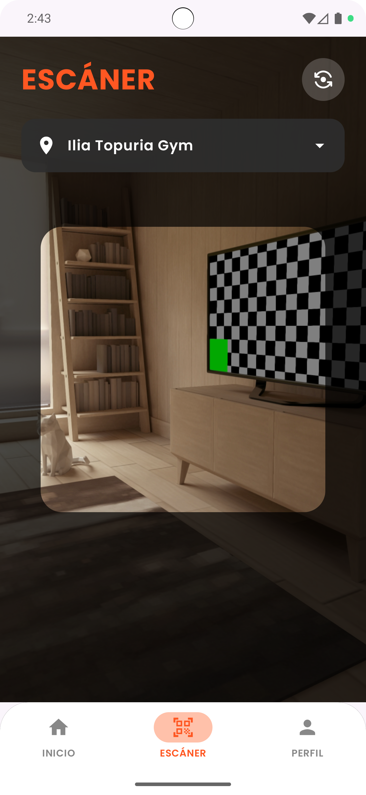               |
| **Detalle de sede** | Vista completa con aforo actual, controles de apertura y métricas | 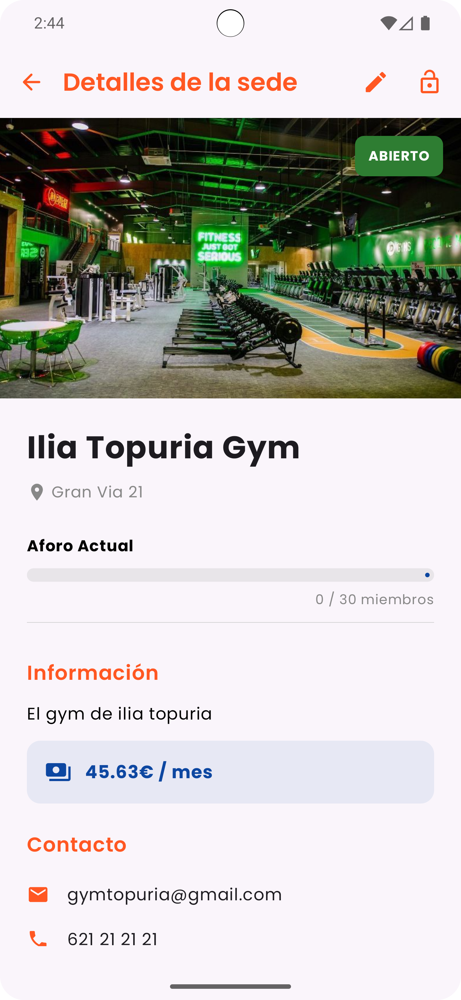       |
| **Perfil enterprise** | Datos de la cuenta empresarial y configuración                    | 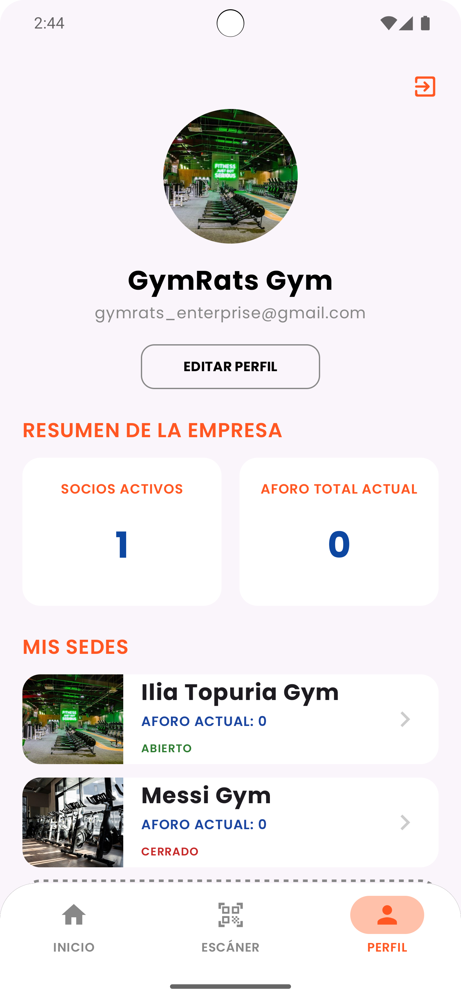    |

## ✨ Funcionalidades principales

### Usuarios estándar
- Registro y autenticación segura con validación de contraseña
- Visualización de gimnasios disponibles y suscripciones activas
- Acceso rápido a código QR personal para entrada a gimnasios
- Consulta de historial de accesos y actividad reciente
- Gestión del perfil personal con subida de avatar

### Usuarios enterprise
- Registro y gestión múltiple de sedes deportivas
- Control en tiempo real del aforo y estado de apertura/cierre
- Vinculación de usuarios como socios mediante username o ID
- Escaneo de códigos QR para validar accesos de miembros
- Visualización de estadísticas empresariales (sedes, suscriptores, aforo)
- Gestión completa de suscripciones y membresías

## 🔧 Implementación técnica

### Comunicación con la API
Se utiliza Retrofit con interceptores para gestión automática de tokens:

```kotlin
// Configuración base de Retrofit
val retrofit = Retrofit.Builder()
    .baseUrl(BuildConfig.BASE_URL)
    .addConverterFactory(GsonConverterFactory.create())
    .client(okHttpClient) // Cliente con interceptor de autenticación
    .build()
```

### Carga de imágenes
Coil gestiona la carga asíncrona con caché y redimensionamiento:

```kotlin
// Ejemplo de carga de avatar con Coil
AsyncImage(
    model = ImageRequest.Builder(LocalContext.current)
        .data(userAvatarUrl)
        .crossfade(true)
        .build(),
    contentDescription = "Avatar de usuario",
    modifier = Modifier.size(80.dp).clip(CircleShape)
)
```

### Escaneo de QR con CameraX y ML Kit
Integración de CameraX para previsualización y ML Kit para detección:

```kotlin
// Configuración de análisis de imagen con ML Kit
val options = BarcodeScanningOptions.Builder()
    .setBarcodeFormats(Barcode.FORMAT_QR_CODE)
    .build()
val scanner = BarcodeScanning.getClient(options)
```

### Gestión de permisos (Accompanist)

Se solicita permisos de cámara de forma segura y compatible:

```kotlin
val cameraPermissionState = rememberPermissionState(
    permission = Manifest.permission.CAMERA
)

LaunchedEffect(cameraPermissionState.status) {
    if (cameraPermissionState.status.isGranted) {
        // Iniciar cámara
    }
}
```

## 🚀 Configuración del entorno de desarrollo

### 1. Requisitos previos

- Android Studio Ladybug o superior
- JDK 17 o superior
- Android SDK con API 36 (compileSdk)
- Emulador o dispositivo físico con Android 7.0+

### 2. Clonar el repositorio

```bash
git clone <url-del-repositorio>
cd Android-APP
```

### 3. Configurar la URL de la API

Se debe editar el archivo `app/src/main/java/com/gymrats/gymratsapp/remote/RetrofitClient.kt` y actualizar la constante `BASE_URL` con la dirección del backend:

```kotlin
private const val BASE_URL = "https://tu-api.onrender.com/"
```

## 🧪 Pruebas y ejecución

### Ejecutar en emulador

1. Abrir `Tools > Device Manager` en Android Studio
2. Crear un nuevo dispositivo virtual con una imagen de sistema compatible (API 24+)
3. Iniciar el emulador
4. Ejecutar la app con `Run > Run 'app'` o `Shift + F10`

### Ejecutar en dispositivo físico

1. Activar "Opciones de desarrollador" en el dispositivo Android
2. Habilitar "Depuración USB"
3. Conectar el dispositivo vía USB
4. Ejecutar la app con `Run > Run 'app'`

## 📦 Generación de APK para distribución

### APK de release (para distribución a socios)

En Android Studio: `Build > Generate Signed App Bundle or APK...`

El APK firmado se generará en: `app/build/outputs/apk/release/app-release.apk`

### Distribución a socios de gimnasios

El archivo APK generado (`app-release.apk`) es el artefacto que se distribuye a los socios de los gimnasios para su instalación. Se recomienda:

- Distribuir mediante enlace seguro o plataforma MDM corporativa
- Incluir instrucciones básicas de instalación (habilitar "Orígenes desconocidos")
- Proporcionar soporte para configuración inicial de cuenta

## 📄 Licencia

Este proyecto forma parte de un Trabajo de Fin de Grado. Su uso está restringido a fines académicos y de demostración. La distribución del APK a terceros requiere autorización expresa.